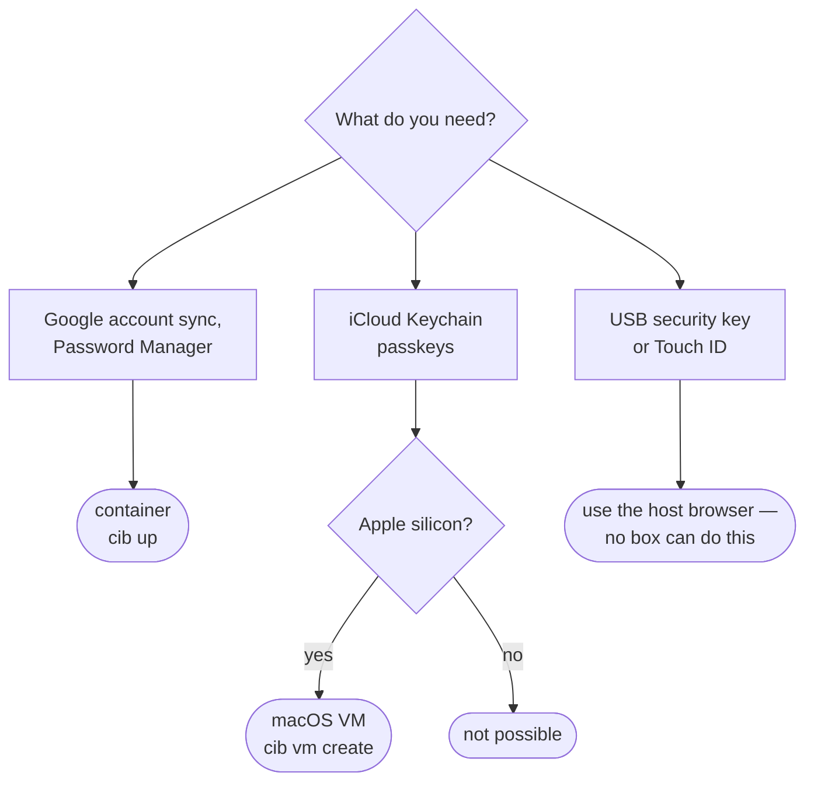
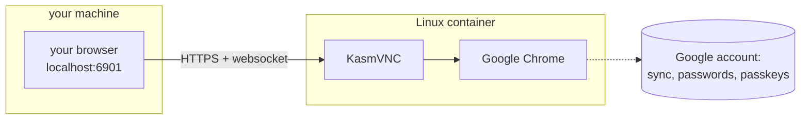
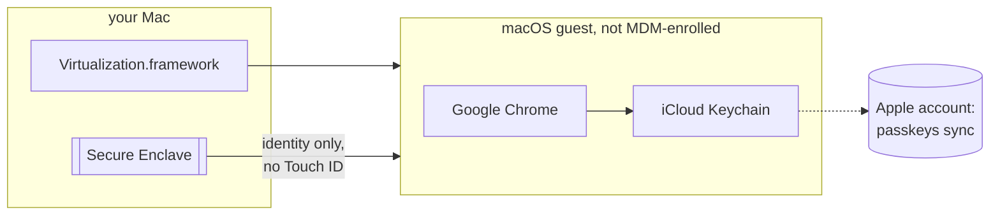

# chrome-in-a-box

Real Google Chrome in a box, so the browser you use for your own things is not the
one your machine's policy manages. One command up, one command down, and the
profile survives restarts.

```bash
cib up      # start it
cib open    # open https://localhost:6901/?resize=scale
cib down    # stop it (profile is kept)
```

One file, standard library only. Run it straight from a checkout with `./cib.py box up`,
install it as a `cib` command, or download a self-contained binary — see
[Install](#install).

No login prompt. Accept the self-signed certificate once and you are in.

## Why

A browser can end up locked down by policy — password manager off, autofill off,
settings greyed out behind an "administrator" badge. That is fine for work, but it
also applies to everything else you do in that browser.

This runs a **separate** Chrome in a guest — a Linux container, or a macOS VM.
Host browser policy does not reach into a guest, so that Chrome is unmanaged: the
built-in password manager, autofill and account sync all work normally. Nothing on
the host is modified, disabled or worked around — it is simply a second browser
that happens to live in a box.

## Two variants

There is no single box that does everything, because the isolation that keeps host
policy out also keeps the host keychain out. So there are two, and they fail in
opposite directions.

|                                       | `cib box up` — **container**       | `cib vm …` — **macOS VM**               |
| ------------------------------------- | ------------------------------ | --------------------------------------- |
| Runs on                               | anything with podman or docker | Apple silicon only                      |
| Free of host browser policy           | yes                            | yes                                     |
| Google account sync, Password Manager | yes                            | yes                                     |
| **iCloud Keychain + its passkeys**    | **no**                         | **yes**                                 |
| Touch ID                              | no                             | no — falls back to the account password |
| Hardware security key (USB)           | no                             | no                                      |
| Weight                                | ~3 GB image, seconds to start  | ~40 GB, minutes to start                |
| Used from                             | a tab in your own browser      | its own window                          |



### The container



[kasmweb/chrome](https://hub.docker.com/r/kasmweb/chrome) serves a
[KasmVNC](https://github.com/kasmtech/KasmVNC) web client. Keyboard and mouse travel
over a **websocket** — which matters, see [Design notes](#design-notes). The macOS
keychain is not reachable: a Linux guest has no Secure Enclave.

### The macOS VM



Since macOS 15, Apple supports signing a guest VM into an Apple Account, so iCloud
Keychain — and therefore passkeys — sync into it. The guest was never enrolled in
any MDM, so its Chrome reads no managed policy. It has no Secure Enclave of its own
and no Touch ID, so passkey use asks for the account password instead of a finger.

> The VM must be **created from** a macOS 15+ installer. Upgrading or cloning an
> older VM does not get an Apple Account identity — `cib vm create` does it
> the right way.

## Install

Three ways, pick one:

```bash
# 1. from a checkout — nothing to install
git clone https://github.com/sapn95/chrome-in-a-box && cd chrome-in-a-box
./cib.py box up

# 2. with Homebrew (the tap lives in this repo, no second repo to add)
brew tap sapn95/tap https://github.com/sapn95/chrome-in-a-box
brew install sapn95/tap/cib     # the full name is what grants trust; plain
cib up                          # `brew install cib` asks you to `brew trust` first

# 3. as a command, in its own environment
uv tool install git+https://github.com/sapn95/chrome-in-a-box    # or: pipx install ...
cib box up

# 4. a self-contained binary — no Python needed at all
#    (download the asset for your platform from the Releases page)
tar -xzf cib-macos-arm64.tar.gz && ./cib box up
```

The binary is compiled with [Nuitka](https://nuitka.net) — Python translated to C —
so it needs no interpreter and no dependencies at all. It is about 8 MB. Linux
binaries are built inside UBI10 so they link against a supported base.

## Requirements

- Python 3.10 or newer (macOS and every Linux ship one)
- For the container: **podman or docker**
- For the macOS VM: **Apple silicon** and [tart](https://tart.run)
  (`brew install cirruslabs/cli/tart`), plus ~40 GB free and 8 GB RAM to spare
- On Apple Silicon: **Rosetta**, because Google ships Chrome for Linux on amd64 only.
  Without it, emulated Chrome is slow and crash-prone. To enable it for podman:

  ```bash
  mkdir -p ~/.config/containers
  printf '[machine]\nprovider = "applehv"\nrosetta = true\n' >> ~/.config/containers/containers.conf
  podman machine stop && podman machine rm -f podman-machine-default
  podman machine init --cpus 4 --memory 5722 --now
  ```

  ⚠️ Recreating the machine deletes all its images, containers and volumes. Only do
  this if it is not shared with other work.

## Commands

| Command      | What it does                                             |
| ------------ | -------------------------------------------------------- |
| `cib box up`     | start the container, wait for the desktop, launch Chrome |
| `cib box down`   | stop and remove the container (profile is kept)          |
| `cib box open`   | open the web UI in your browser                          |
| `cib box status` | show container state                                     |
| `cib box logs`   | show the last 200 log lines (`-f` follows instead)       |
| `cib box shell`  | shell into the container                                 |
| `cib box engine` | print the container engine that will be used             |
| `cib box reset`  | delete the browser profile (asks first)                  |

The macOS VM variant (Apple silicon):

| Command         | What it does                                    |
| --------------- | ----------------------------------------------- |
| `cib vm create` | build the VM from a fresh macOS image (large)   |
| `cib vm up`     | start it — a window opens                       |
| `cib vm down`   | stop it                                         |
| `cib vm status` | list VMs and their state                        |
| `cib vm delete` | delete the VM and everything in it (asks first) |

After `vm create`, finish it once by hand: Setup Assistant → sign in to your Apple
Account → System Settings → Apple Account → iCloud → turn on **Passwords &
Keychain** → install Chrome → sign in to Google.

`up` is idempotent: if the container is already serving it just re-applies the
resolution and revives Chrome, so your tabs survive. `CIB_FORCE=1` recreates it
instead, which is what you need after changing the image or an environment setting.

Overridable: `CIB_PORT`, `CIB_RESOLUTION`, `CIB_WAIT_SECS`, `CIB_ENGINE`,
`CIB_IMAGE`, `CIB_NAME`, `CIB_VOLUME`, `CIB_PASSWORD`, `CIB_LOG_TAIL`, `CIB_FORCE`,
and for the VM `CIB_VM_NAME`, `CIB_VM_CPUS`, `CIB_VM_MEMORY`, `CIB_VM_DISK`,
`CIB_VM_DISPLAY`.

## Passkeys — what does and does not work

**A passkey cannot be forwarded from the host into a guest.** A Touch ID passkey is
bound to the Mac's Secure Enclave, and WebAuthn deliberately offers no way to relay
that — which is the property it exists for. Nor is the QR / "use your phone" flow a
way around it: the phone's Bluetooth advertisement is an *input to the key
derivation*, not a UI step, so a guest with no radio cannot complete the handshake.
Chrome checks for a Bluetooth adapter first and does not even offer the QR code.

So a passkey has to *live* in the box. There are two ways to arrange that:

- **Container → Google Password Manager.** Register a new passkey inside the
  container; it syncs with your Google account.
- **macOS VM → iCloud Keychain.** The passkeys you already have sync in, because the
  VM is signed into your Apple Account.

### In the container: Google Password Manager

Chrome on Linux is a first-class GPM passkey platform — it needs no TPM (on Linux
Chrome deliberately stores the identity key on disk instead), no USB and no
Bluetooth. It syncs over the network, which is the only transport a container has.

So when a site says *"no passkeys available on this device"*, that passkey lives in
iCloud Keychain and cannot come here. Register a **second** passkey from inside this
Chrome instead:

1. Sign into your Google account in this Chrome, and make sure
   `chrome://password-manager/settings` → *Offer to save passwords and passkeys* is
   on. Chrome refuses to create GPM passkeys otherwise.
2. Get into the site once by another route — a recovery code, a second factor that
   is not a passkey, or a session started on the host.
3. Add a new passkey / security key in the site's account settings. Chrome on Linux
   offers **Google Password Manager** by default; do not pick "this device", which
   dies with the container. Set the 6-digit GPM PIN and keep it somewhere safe: it
   is the only way to decrypt GPM passkeys on a new device.
4. Regenerate the site's recovery codes if you burned one.

The passkey then works both here and on the host, because it lives in your Google
account rather than on either machine.

**How much account to put in the box.** The profile volume is only lightly
obfuscated (Chrome runs `--no-sandbox`, and the image ships no keyring), so whoever
can read that volume or `exec` into the container gets every credential in the
Google account signed in there.

On a single-user machine you keep to yourself, that is the same trust boundary as
your own browser profile, and signing in with your normal account is a reasonable
call. Prefer a dedicated Google account when any of these is true: the host is
shared or managed by someone else, the port is exposed beyond `127.0.0.1`, other
people can run containers on that engine, or the account is one you would not want
to lose in one go.

Not possible, so do not spend an evening on it: forwarding a host passkey, the
QR-code / phone flow (the Bluetooth advertisement is an input to the handshake — no
radio, no ceremony), passing a USB security key into the VM (Apple's virtualisation
framework exposes only mass storage today), and exporting an iCloud Keychain passkey
into Google Password Manager (Chrome ships no importer).

## Design notes

- **Why KasmVNC and not a WebRTC-based streamer.** WebRTC-based remote browsers
  (Neko, Selkies) send input over a WebRTC data channel, which ad-blockers and
  WebRTC-leak-prevention extensions silently block: the screen renders, "take
  control" succeeds, and nothing you type arrives. KasmVNC uses a plain websocket,
  which those extensions leave alone.
- **Why real Chrome and not Chromium.** Chromium is arm64-native and faster, but
  third-party Chromium builds ship without Google's API keys, so there is no
  account sync and no Google Password Manager. That is the whole point here, so the
  amd64 Chrome image plus Rosetta wins.
- **Why the resolution is fixed at 1920x1200.** KasmVNC only ships modes up to that
  size; larger values silently fall back to 1024x768. `?resize=scale` then scales it
  to your window, which stays crisp on a HiDPI display.
- **Why there is a password despite no login prompt.** KasmVNC refuses to start with
  a password under 6 characters, so one is set and the prompt is disabled with
  `DisableBasicAuth`. The port is bound to `127.0.0.1`, so nothing is reachable from
  the network anyway.
- **Why HTTPS with a self-signed certificate.** The image generates its own
  certificate at boot and forcing plain HTTP breaks that setup, so the server exits.
  One certificate accept is the smaller cost.
- **Why `--network bridge` is passed explicitly.** The image's startup script waits
  for a `veth` interface before it starts the desktop. Rootless podman's default
  network namespace (pasta/slirp4netns) has none, so the container boots forever and
  the web UI never answers. It is a no-op on docker and on rootful podman.

## Security

- The web UI is bound to `127.0.0.1` — never exposed to the network.
- The browser profile lives in a named volume, not in the repo.
- Settings that are known to kill the container — a password under 6 characters, a
  resolution above 1920x1200 — are rejected up front instead of failing obscurely.
- CI runs ruff (lint + format), yamllint, actionlint, markdownlint, a gitleaks
  secret scan, and the unit tests on Python 3.10 and 3.14 with a coverage floor,
  everything Python inside a UBI10 container, plus a smoke job
  that boots the real container and asserts the UI answers 200 (not 401, which would
  mean the login prompt is back), Chrome is running, and the desktop really is at
  1920x1200. Every job has a timeout.

## Licence

MIT — see [LICENSE](LICENSE).
