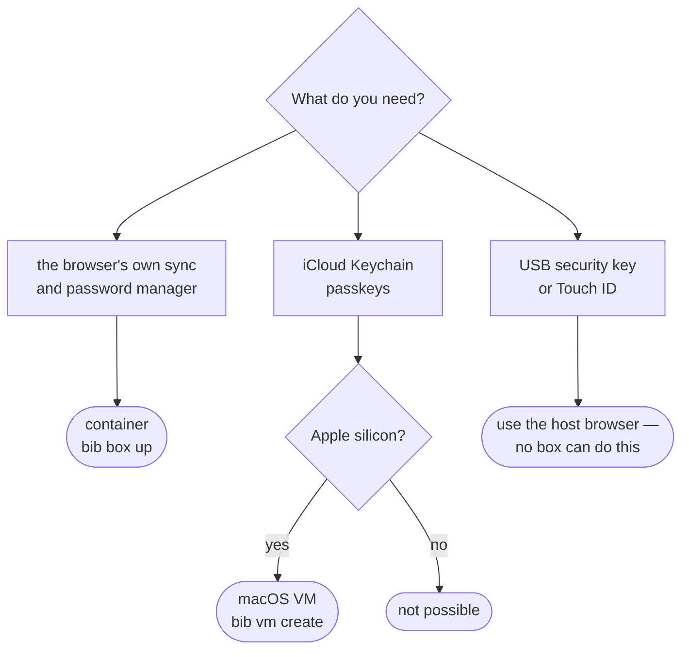
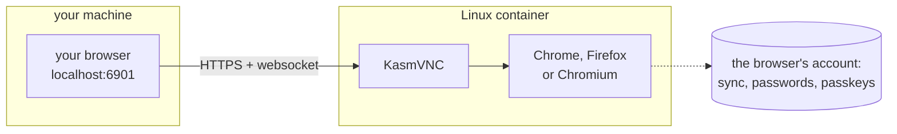
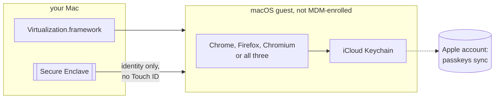

# browser-in-a-box

A real, unmanaged browser in a box, so the one you use for your own things is not
the one your machine's policy manages. Chrome, Firefox or Chromium. One command up,
one command down, and the profile survives restarts.

```bash
bib box up  # start it
bib box open # open https://localhost:6901/?resize=remote
bib box down # stop it (profile is kept)
```

The standard library, and one optional dependency. Run it straight from a checkout
with `./bib.py box up`, install it as a `bib` command, or download a self-contained
binary — see [Install](#install).

No login prompt. Accept the self-signed certificate the browser warns about and
you are in.

## Why

A browser can end up locked down by policy — password manager off, autofill off,
settings greyed out behind an "administrator" badge. That is fine for work, but it
also applies to everything else you do in that browser.

This runs a **separate** browser in a guest — a Linux container, or a macOS VM.
Host browser policy does not reach into a guest, so that browser is unmanaged: the
built-in password manager, autofill and account sync all work normally. Nothing on
the host is modified, disabled or worked around — it is simply a second browser
that happens to live in a box.

## What you need, before anything else

- **The container works anywhere** podman or docker runs — Mac, Linux, Windows.
- **The VM works only on a Mac with Apple silicon** (M1 and later). Not on an
  Intel Mac, not on Linux, not on Windows. That is not a missing feature: it uses
  Apple's own Virtualization framework to run macOS, and only Apple hardware may
  legally and technically do that.
- Everything is optional except the one you pick. You do not need both.

## What you get

- A **second browser** that your machine's policy does not manage: password
  manager on, autofill on, settings not greyed out.
- **Chrome, Firefox or Chromium** — `BIB_BROWSER` picks it. The VM can also take
  `all` and install the three side by side.
- Its **profile survives** restarts, and the box surviving is the point: this is
  a browser you keep, not a throwaway one.
- **Downloads land on your Mac**, in `~/Downloads/<vm name>`.
- **Copy and paste** between host and guest.
- With the VM, **your passkeys**: it signs into your Apple Account, so iCloud
  Keychain syncs in and passkeys work.
- A **clickable app** in `~/Applications`, so none of this needs a terminal after
  the first build.

## Two variants

There is no single box that does everything, because the isolation that keeps host
policy out also keeps the host keychain out. So there are two, and they fail in
opposite directions.

|                                       | `bib box up` — **container**   | `bib vm …` — **macOS VM**               |
| ------------------------------------- | ------------------------------ | --------------------------------------- |
| Runs on                               | anything with podman or docker | Apple silicon only                      |
| Free of host browser policy           | yes                            | yes                                     |
| Google account sync, Password Manager | yes                            | yes                                     |
| **iCloud Keychain + its passkeys**    | **no**                         | **yes**                                 |
| Touch ID                              | no                             | no — falls back to the account password |
| Hardware security key (USB)           | no                             | no                                      |
| Weight                                | ~3 GB image, seconds to start  | ~40 GB, minutes to start                |
| Used from                             | a tab in your own browser      | its own window                          |



### The container



[kasmweb/chrome](https://hub.docker.com/r/kasmweb/chrome) serves a
[KasmVNC](https://github.com/kasmtech/KasmVNC) web client. Keyboard and mouse travel
over a **websocket** — which matters, see [Design notes](#design-notes). The macOS
keychain is not reachable: a Linux guest has no Secure Enclave.

### The macOS VM



Since macOS 15, Apple supports signing a guest VM into an Apple Account, so iCloud
Keychain — and therefore passkeys — sync into it. The guest was never enrolled in
any MDM, so the browser in it reads no managed policy. It has no Secure Enclave of its own
and no Touch ID, so passkey use asks for the account password instead of a finger.

The VM is started with **bridged** networking, so it gets an address from the real
network and inherits a DNS resolver that works. tart's default shared mode hands
out the vmnet gateway as the resolver, and on some hosts that gateway does not
answer DNS at all — the guest then has an address but resolves nothing, which
Setup Assistant reports as "not connected to the Internet". Override with
`BIB_VM_NET=shared` or point at another interface with `BIB_VM_INTERFACE`.

> The VM must be **created from** a macOS 15+ installer. Upgrading or cloning an
> older VM does not get an Apple Account identity — `bib vm create` does it
> the right way.

## Requirements

- Python 3.10 or newer. Note that macOS ships 3.9, so install one (`brew install
  python@3.14`) or use the Homebrew/binary install below, which needs no Python to run
- For the container: **podman or docker**
- For the macOS VM: **Apple silicon**, [tart](https://tart.run)
  (`brew install cirruslabs/cli/tart`), ~40 GB free and 8 GB RAM to spare. The
  build patches the guest's disk, which needs `sudo` once — nothing else does.
  [Packer](https://packer.io) (`brew install hashicorp/tap/packer`) is **only**
  needed for the `BIB_VM_PACKER=1` fallback described below
- On Apple Silicon: **Rosetta**, because Google ships Chrome for Linux on amd64 only.
  Without it, emulated Chrome is slow and crash-prone. To enable it for podman:

  ```bash
  mkdir -p ~/.config/containers
  printf '[machine]\nprovider = "applehv"\nrosetta = true\n' >> ~/.config/containers/containers.conf
  podman machine stop && podman machine rm -f podman-machine-default
  podman machine init --cpus 4 --memory 5722 --now
  ```

  ⚠️ Recreating the machine deletes all its images, containers and volumes. Only do
  this if it is not shared with other work.

## Install

Four ways, pick one:

```bash
# 1. from a checkout — nothing to install
git clone https://github.com/sapn95/browser-in-a-box && cd browser-in-a-box
./bib.py box up

# 2. with Homebrew
brew tap sapn95/tap
brew install sapn95/tap/bib     # the full name is what grants trust; plain
bib box up                      # `brew install bib` asks you to `brew trust` first

# 3. as a command, in its own environment
uv tool install git+https://github.com/sapn95/browser-in-a-box    # or: pipx install ...
bib box up

# 4. a compiled build — no Python needed to run it
#    (download the asset for your platform from the Releases page)
tar -xzf bib-macos-arm64.tar.gz && ./bib-macos-arm64/bib box up
```

All four can build the macOS VM: the compiled builds carry `bibpatch.py` and the
packer template beside the binary, because `bib` spawns them rather than importing
them and Nuitka would otherwise leave them behind.

Compiled with [Nuitka](https://nuitka.net) — Python translated to C — so it needs no
interpreter and no dependencies to run.

A compiled build is not a single file: the archive holds `bib` next to the shared
objects it links against, so keep the folder together. Homebrew and the Linux builds
handle that for you; the Linux ones are compiled inside UBI10 so they link against a
supported base.

One exception, and only for the VM: the patch step is a separate script that `bib`
spawns rather than imports, so it needs a working `python3` on the machine. Every
Mac has `/usr/bin/python3`, but without the Command Line Tools that is a stub that
exits the moment it runs — `bib` checks and says so, rather than failing halfway
through a build. `xcode-select --install` is enough. The container variant needs
nothing.

### Coming from 2.x

Version 3 finished a rename the project only half did. The command is `bib`, not
`cib`; the modules are `bib*.py`; every environment variable is `BIB_*` rather than
`CIB_*`; the settings file is `bib.yaml`; and the default VM is `browser-vm`, not
`chrome-vm`. There is no compatibility shim for any of it, and nothing is migrated
for you — a name that half-works is worse than one that clearly does not.

What that means in practice:

```bash
brew uninstall cib && brew install sapn95/tap/bib   # the command
BIB_VM_NAME=chrome-vm bib vm up                     # keep an existing guest
mv ~/.config/browser-in-a-box/cib.yaml ~/.config/browser-in-a-box/bib.yaml
```

The container and its profile volume are **not** renamed — they have been
`browser-in-a-box` and `browser-in-a-box-profile` since 2.0, and they stay that way.
If you are coming from 1.x, where they were named after Chrome, the old ones are
still there and this will not find them: either point at them with `BIB_NAME` and
`BIB_VOLUME`, or start fresh and sign in again.

One thing from 1.x cannot be recreated. Its configuration directory was
`~/.config/chrome-in-a-box`, and it holds the **only** copy of a built VM's
generated password and both key pairs — the guest's disk was patched with that key.
Version 2 moved it for you; version 3 does not. If you skipped 2.x, move it by hand
before running anything:

```bash
mv ~/.config/chrome-in-a-box ~/.config/browser-in-a-box
```

Without it `bib vm password` and `bib vm setup` report no saved password for a guest
that is running perfectly well, and the only way back in rewrites the account.

## Commands

| Command          | What it does                                                  |
| ---------------- | ------------------------------------------------------------- |
| `bib box up`     | start the container, wait for the desktop, launch the browser |
| `bib box down`   | stop and remove the container (profile is kept)               |
| `bib box open`   | open the web UI in your browser                               |
| `bib box status` | show container state                                          |
| `bib box logs`   | show the last 200 log lines (`-f` follows instead)            |
| `bib box shell`  | shell into the container                                      |
| `bib box engine` | print the container engine that will be used                  |
| `bib box reset`  | delete the browser profile (asks first)                       |

The macOS VM variant (Apple silicon):

| Command           | What it does                                          |
| ----------------- | ----------------------------------------------------- |
| `bib vm create`   | build it, start it, install the browser — one command |
| `bib vm prepare`  | redo just the offline preparation of a built VM       |
| `bib vm up`       | start it again — a window opens, shell blocks         |
| `bib vm setup`    | redo just the browser install, over SSH               |
| `bib vm open`     | start it if stopped, then show its screen             |
| `bib vm icon`     | write a clickable app into `~/Applications`           |
| `bib vm password` | print the generated guest password                    |
| `bib vm login`    | print the guest account name and password             |
| `bib vm ssh`      | open a shell in the guest                             |
| `bib vm ip`       | print the guest's address                             |
| `bib vm viewer`   | reprint the screen address (`BIB_VM_VIEWER=vnc`)      |
| `bib vm down`     | stop it                                               |
| `bib vm status`   | list VMs and their state                              |
| `bib vm delete`   | delete the VM and everything in it (asks first)       |

`vm create` is **unattended**, and it never shows Setup Assistant at all. Setup
Assistant cannot be skipped without MDM, and driving it with synthetic keystrokes is
brittle — one changed pane and the sequence types into the wrong field. So `bib`
does the other thing: it boots the fresh guest once, then writes the state Setup
Assistant would have produced straight onto its disk, before the guest ever reaches
a login window. That is deterministic — no timing, no OCR, nothing to re-learn when
Apple moves a button.

What gets written: an account with a **generated** password, autologin, Remote
Login, bib's SSH key and the guest's host key, and **this host's keyboard layout**
(so the guest types where your fingers already do). Only that one step needs
`sudo`.

`bib` never prompts for a password itself, so **cache the credential first**:

```bash
sudo -v && bib vm create
```

Both in the **same terminal**, and that matters: sudo remembers a credential per
tty, so one cached in another window does not count — and a process started
without a tty (a launchd job, a wrapper, an agent) can never obtain one at all.

It is checked before the download starts, not after — and held open across the
build, because sudo forgets a credential in about five minutes and the build takes
thirty to sixty. If the patch step still fails, `bib vm prepare` redoes just it,
without rebuilding the VM.

The browser **is** part of `vm create`: it builds the VM, starts it, waits for SSH
and installs whatever `BIB_BROWSER` names, plus the clipboard agent, all from the
one command. `bib vm setup`
exists to redo only that last step against a guest that is already up.

Every write onto the guest's disk is one Apple could change, so `BIB_VM_PACKER=1`
keeps the old path available: it drives Setup Assistant with Packer instead. It
needs Packer installed, and a VM that does not exist yet (`bib vm delete` first).

One thing stays manual, because Apple makes it interactive on purpose: the
**Apple Account sign-in**, in the guest's own window.

It cannot be scripted, and not for want of an unexplored trick. Joining the
iCloud Keychain sync circle is a cryptographic handshake, not a setting: a new
device is either *sponsored* by a device already in the circle, or it recovers
via an SMS code plus the iCloud security code. Both need a second party in the
moment. The `KEYCHAIN_SYNC` entry in `defaults read MobileMeAccounts` is a
read-only mirror of that state — accountsd owns the truth in a TCC-protected
database — and `otctl`, which does drive Octagon, is walled off behind
`com.apple.private.*` entitlements that only Apple can sign. A configuration
profile cannot help either: `allowCloudKeychainSync` only *permits*, and already
defaults to true.

The good news is that the sign-in is enough on its own. Signing in switches
Keychain sync on and joins the circle, so there is no second toggle to find:

```console
$ otctl status | grep State:
State: Ready
```

`bib vm up` runs the guest in the foreground: the window opens and the shell does
not come back until the VM shuts down, and Ctrl-C there kills the guest. Run the
steps after it from a **second terminal**.

Neither `bib vm setup` nor `bib vm ssh` asks you to type anything. `vm create`
generates an SSH key pair, installs the public half in the guest, and plants the
guest's own **host key** as well — so the very first connection is verified rather
than trusted. Everything lives beside the password in
`~/.config/browser-in-a-box/<BIB_VM_NAME>/` — a directory per VM, so a second one
cannot reuse the first's key — and `bib vm delete` removes all of it. An older
bib kept them one level up; the first VM command you run moves them.

The guest has no Touch ID, so passkey confirmations do ask for the account
password. You never type that either — `bib vm password` prints it, and you paste
it.
Clipboard sharing between host and guest is not a flag: it needs
[tart-guest-agent](https://github.com/cirruslabs/tart-guest-agent) running inside
the guest, which `vm setup` installs.

`up` is idempotent: if the container is already serving it just re-applies the
resolution and revives the browser, so your tabs survive. `BIB_FORCE=1` recreates it
instead, which is what you need after changing the image or an environment setting.

Overridable: `BIB_PORT`, `BIB_RESOLUTION`, `BIB_WAIT_SECS`, `BIB_ENGINE`,
`BIB_IMAGE`, `BIB_NAME`, `BIB_VOLUME`, `BIB_PASSWORD`, `BIB_LOG_TAIL`, `BIB_FORCE`,
and for the VM `BIB_VM_NAME`, `BIB_VM_CPUS`, `BIB_VM_MEMORY`, `BIB_VM_DISK`,
`BIB_VM_DISPLAY`, `BIB_VM_NET`, `BIB_VM_INTERFACE`, `BIB_VM_USER`, `BIB_VM_SHARE`,
`BIB_BROWSER` (chrome, firefox or chromium),
`BIB_VM_PASSWORD` (a password of your own instead of a generated one; letters and
digits only, and no y or z, because the packer path types it as keystrokes),
`BIB_VM_CAPTURE_KEYS` (send Cmd+Space, Cmd+Tab and the rest to the guest while
its window has focus — off by default, because it is all-or-nothing and a host
launcher on Cmd+Space becomes unreachable until you click away),
`BIB_VM_FIRSTBOOT_SECS` (how long the guest is given to lay down its first-boot
state before the disk is patched — 180 s, raise it on a slow disk) and
`BIB_VM_IPSW` (the macOS installer: `latest` by default, or a URL or `.ipsw` path
to pin the guest to one version).

### Which browser

`BIB_BROWSER` picks it: `chrome` (the default), `firefox`, `chromium` — or `all`,
which is a **VM-only** mode that installs all three side by side. The container
cannot do `all`: one image serves one browser, and there is no image with three.
Its launcher wears a globe under a net rather than any one browser's mark.

For a single browser it
applies to both variants — the container serves the matching Kasm image, and the
VM downloads and configures that browser instead. The launcher `bib vm icon`
writes gets the browser's own colours, so three of them side by side in the Dock
are told apart at a glance.

```bash
BIB_BROWSER=firefox bib box up
BIB_BROWSER=chromium BIB_VM_NAME=chromium-vm bib vm create
```

Chromium is the odd one: it has no release for macOS, only per-commit snapshots,
so the build number is looked up before the download. Firefox keeps its settings
in a `user.js` and a `profiles.ini` rather than JSON, and is made the default
browser with its own switch.

### The settings file

Everything above can live in `~/.config/browser-in-a-box/bib.yaml` instead of your
shell profile. `BIB_CONFIG` points somewhere else.

```yaml
box:
  port: 6901
  resolution: 1280x800

vm:
  name: browser-vm
  user: admin
  password: admin        # or leave it out for a generated one
  display: 1280x800
  net: bridged
  share: ~/Downloads/browser-vm
  capture_keys: false
```

Keys are the environment variable names without their prefix, lowercased: `[box]`
holds the `BIB_*` ones and `[vm]` the `BIB_VM_*` ones. An environment variable
still wins, so exporting one for a single command overrides the file without
editing it.

This is the one thing outside the standard library — reading it needs PyYAML,
which the Homebrew, `uv tool` and compiled installs all bring with them. Running
`./bib.py` from a bare checkout without it still works; it only refuses if a
settings file is actually there, because ignoring one silently is the same as the
setting not working.

`BIB_VM_VIEWER` picks how you look at the guest. `window` (the default) is tart's
own window. `vnc` opens no window at all: tart's `--vnc` is not a VNC server of
its own, it turns on macOS Screen Sharing inside the guest and prints an address
for it, which `bib vm viewer` reprints. That address carries the guest account's
own password — the same one that unlocks its screen and answers for `sudo`, not
something generated per run and not something that expires. Handle it like the
password it is.

**The browser's** downloads in the guest land in `~/Downloads/browser-vm` on the
host. The folder is shared into the VM and the browser is pointed at it through its own
settings. Point it elsewhere with `BIB_VM_SHARE`.

Only the browser. Replacing the guest's `~/Downloads` with a symlink would make every
app follow, but macOS refuses: TCC protects Downloads, Desktop and Documents, and
renaming one over SSH fails with `Operation not permitted` however much root you
have. Other apps in the guest save to the guest's own `~/Downloads`, where a link
named `on-the-host` points at the share for dragging things across by hand.

## Passkeys — what does and does not work

**A passkey cannot be forwarded from the host into a guest.** A Touch ID passkey is
bound to the Mac's Secure Enclave, and WebAuthn deliberately offers no way to relay
that — which is the property it exists for. Nor is the QR / "use your phone" flow a
way around it: the phone's Bluetooth advertisement is an *input to the key
derivation*, not a UI step, so a guest with no radio cannot complete the handshake.
Chrome checks for a Bluetooth adapter first and does not even offer the QR code.

So a passkey has to *live* in the box. There are two ways to arrange that:

- **Container → Google Password Manager.** Register a new passkey inside the
  container; it syncs with your Google account.
- **macOS VM → iCloud Keychain.** The passkeys you already have sync in, because the
  VM is signed into your Apple Account.

### In the container: Google Password Manager

Chrome on Linux is a first-class GPM passkey platform — it needs no TPM (on Linux
Chrome deliberately stores the identity key on disk instead), no USB and no
Bluetooth. It syncs over the network, which is the only transport a container has.

So when a site says *"no passkeys available on this device"*, that passkey lives in
iCloud Keychain and cannot come here. Register a **second** passkey from inside this
Chrome instead:

1. Sign into your Google account in this Chrome, and make sure
   `chrome://password-manager/settings` → *Offer to save passwords and passkeys* is
   on. Chrome refuses to create GPM passkeys otherwise.
2. Get into the site once by another route — a recovery code, a second factor that
   is not a passkey, or a session started on the host.
3. Add a new passkey / security key in the site's account settings. Chrome on Linux
   offers **Google Password Manager** by default; do not pick "this device", which
   dies with the container. Set the 6-digit GPM PIN and keep it somewhere safe: it
   is the only way to decrypt GPM passkeys on a new device.
4. Regenerate the site's recovery codes if you burned one.

The passkey then works both here and on the host, because it lives in your Google
account rather than on either machine.

**How much account to put in the box.** The profile volume is only lightly
obfuscated (Chrome runs `--no-sandbox`, and the image ships no keyring), so whoever
can read that volume or `exec` into the container gets every credential in the
Google account signed in there.

On a single-user machine you keep to yourself, that is the same trust boundary as
your own browser profile, and signing in with your normal account is a reasonable
call. Prefer a dedicated Google account when any of these is true: the host is
shared or managed by someone else, the port is exposed beyond `127.0.0.1`, other
people can run containers on that engine, or the account is one you would not want
to lose in one go.

Not possible, so do not spend an evening on it: forwarding a host passkey, the
QR-code / phone flow (the Bluetooth advertisement is an input to the handshake — no
radio, no ceremony), passing a USB security key into the VM (Apple's virtualisation
framework exposes only mass storage today), and exporting an iCloud Keychain passkey
into Google Password Manager (Chrome ships no importer).

## Design notes

- **Why KasmVNC and not a WebRTC-based streamer.** WebRTC-based remote browsers
  (Neko, Selkies) send input over a WebRTC data channel, which ad-blockers and
  WebRTC-leak-prevention extensions silently block: the screen renders, "take
  control" succeeds, and nothing you type arrives. KasmVNC uses a plain websocket,
  which those extensions leave alone.
- **Why real Chrome and not Chromium.** Chromium is arm64-native and faster, but
  third-party Chromium builds ship without Google's API keys, so there is no
  account sync and no Google Password Manager. That is the whole point here, so the
  amd64 Chrome image plus Rosetta wins.
- **Why the desktop size is dynamic.** The client asks for `?resize=remote`, so
  KasmVNC resizes the desktop to your browser window and maximising actually gives
  you more desktop. Pinning a mode with `BIB_RESOLUTION` is possible but then the
  two fight: KasmVNC only ships modes up to 1920x1200, and larger values silently
  fall back to 1024x768.
- **Why there is a password despite no login prompt.** KasmVNC refuses to start with
  a password under 6 characters, so one is set and the prompt is disabled with
  `DisableBasicAuth`. The port is bound to `127.0.0.1`, so nothing is reachable from
  the network anyway.
- **Why HTTPS with a self-signed certificate.** The image generates its own
  certificate at boot and forcing plain HTTP breaks that setup, so the server exits.
  It generates a *new* one on every boot, so the browser asks again after a
  `BIB_FORCE=1` recreate; accepting it is still the smaller cost.
- **Why `--network bridge` is passed explicitly.** The image's startup script waits
  for a `veth` interface before it starts the desktop. Rootless podman's default
  network namespace (pasta/slirp4netns) has none, so the container boots forever and
  the web UI never answers. It is a no-op on docker and on rootful podman.

## Security

- The web UI is bound to `127.0.0.1` — never exposed to the network.
- The browser profile lives in a named volume, not in the repo.
- Settings that are known to kill the container — a password under 6 characters, a
  resolution that is not one of the modes KasmVNC ships — are rejected up front
  instead of failing obscurely. "In range" is not the same as available: 1600x900
  is smaller than the largest mode and still not one of them.
- CI runs ruff (lint + format), yamllint, actionlint, markdownlint, a gitleaks
  secret scan, and the unit tests on Python 3.10 and 3.14 with a coverage floor,
  everything Python inside a UBI10 container, plus a smoke job
  that boots the real container and asserts the UI answers 200 (not 401, which would
  mean the login prompt is back), the browser is running, and the desktop really is
  at 1920x1200. On every push that is Chrome; the weekly run and `workflow_dispatch`
  do all three, because a smoke test that only ever started Chrome is how the box
  came to run Chrome whatever browser was asked for. Every job has a timeout.

## Licence

MIT — see [LICENSE](LICENSE).
